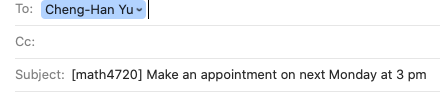

[**Syllabus for Section 101 2 - 3:15 PM**](/documents/syllabus-4720-101-f25.pdf).

[**Syllabus for Section 102 3:30 - 4:45 PM**](/documents/syllabus-4720-102-f25.pdf).

## Time and location

|          | Day     | Time           | Location       |
|----------|---------|----------------|----------------|
| Sec 101  | Mo & We | 2:00 - 3:15 PM | Cuday Hall 131 |
| Sec 102  | Mo & We | 3:30 - 4:45 PM | Cuday Hall 131 |
| Lab      | None    | None           | None           |

## Office Hours

-   My in-person office hours are MoWe 4:50 - 5:50 PM in Cudahy Hall room 353.

-   You are welcome to schedule an online meeting via Microsoft Teams if you need/prefer.


## Prerequisites


- MATH 1400, 1410, or 1450. 

- Basic computer and internet use expected. The course will also assume facility with using the internet and a personal computer. 

- A portion of the course involves programming in [\textsf{R}](https://www.r-project.org/about.html) using [RStudio](https://rstudio.com/), but prior programming experience is not required.


## E-mail Policy

-   I will attempt to reply your email quickly, at least **within 24 hours**.

-   **Expect a reply on Monday if you send a question during weekends**. If you do not receive a response from me within two days, re-send your question/comment in case there was a "mix-up" with email communication (Hope this won't happen!).

-   Please start your e-mail subject line with **[math4720]** or **[mssc5720]** followed by a clear description of your question. See an example below.

```{r}
#| echo: false
#| fig-cap: Email Subject Line Example
#| out-width: 100%

```

- Email etiquette is important. Please read this [article](https://www.insidehighered.com/views/2015/04/16/advice-students-so-they-dont-sound-silly-emails-essay) to learn more about email etiquette.

- I am more than happy to answer your questions about this course or statistics in general. However, due to time constraint, I may choose **NOT** to respond to students' e-mail if

    1. The student could answer his/her own inquiry by reading the syllabus or information on the course website or D2L.
    
    2. The student is asking for an extra credit opportunity. The answer is "no".
    
    3. The student is requesting an extension on homework. The answer is "no".
    
    4. The student is asking for a grade to be raised for no legitimate reason. The answer is "no".
    
    5. The student is sending an email with no etiquette.


## Required Textbook

- **[IS]** [*Introduction to Statistics*](https://chenghanyu-introstatsbook.netlify.app/), by Dr. Cheng-Han Yu. (My online book)

## Optional References

- **[OI] (optional)** [*Introduction to Modern Statistics, 2nd edition*](https://openintro-ims.netlify.app/), by Mine Çetinkaya-Rundel and Johanna Hardin. Publisher: OpenIntro. (computation and data-oriented)


## Grading Policy

- The final grade is earned out of **1000 total points** distributed as follows:
  - **Homework 1 to 8: 200 pts (25 pts each)**
  - **Quiz 1 to 4: 200 pts (50 pts each)**
  - **Exam 1 and 2: 300 pts (150 pts each)**
  - **Final exam: 200 pts**
  - **Project: 100 pts** 
  - **Class participation for MSSC 5720**

- You will **NOT** be allowed any extra credit projects/homework/exam to compensate for a poor average. Everyone must be given the same opportunity to do well in this class. Individual exam will **NOT** be curved.
<!-- however, I may use class participation to make grade adjustments at the end of the semester. -->

- The final grade is based on your percentage of points earned out of 1000 points and the grade-percentage conversion Table. $[x, y)$ means greater than or equal to $x$ and less than $y$. For example, 94.1 is in $[94, 100]$ and the grade is A and 92.8 is in $[90, 94)$ and the grade is A-.

```{r}
#| echo: false
letter <- c("A", "A-", "B+", "B", "B-", "C+", "C", "C-",
                       "D+", "D", "F")
percentage <- c("[94, 100]", "[90, 94)", "[87, 90)", "[83, 87)", "[80, 83)",
                "[77, 80)", "[73, 77)", "[70, 73)", 
                "[65, 70)", "[60, 65)", "[0, 60)")
grade_dist <- data.frame(Grade = letter, Percentage = percentage)
knitr::kable(grade_dist, longtable = TRUE, 
             caption = "Grade-Percentage Conversion")
```
- This is not a course that gives most of students grade A. If you want to obtain a good grade, study hard. No pain, no gain.


### Homework

- Homework will be assigned through the course website.

- To submit your homework, please go to **D2L > Assessments > Dropbox** and upload your homework in **PDF** format.

- There will be totally 8 homework sets graded by your TA.

- MSSC 5720 students may have more or different homework questions.

- The lowest score of the homework sets will be dropped when your final grade is calculated. (That means the lowest score will be replaced with a perfect 25 points. You could only submit 7 homework sets.)

- You will get a better understanding of the material if you discuss it with others. However, you must submit YOUR OWN work. 

- **NO LATE HOMEWORK WILL BE ACCEPTED NOR WILL YOU BE ALLOWED TO MAKE UP MISSED HOMEWORK** for any reason. 


### Quizzes

- There will be 4 in-class quizzes.

- Quiz questions are similar to the questions in the homework assignments.

- Quizzes are individual and in **closed-book** format. No cheat sheet is allowed.

- **No make-up quizzes** unless you got [excused absence](https://bulletin.marquette.edu/policies/attendance/undergraduate/).

- If you miss a quiz due to an excused absence as defined in [Attendance in Academic Regulations](https://bulletin.marquette.edu/policies/attendance/undergraduate/), the 50 pts will be added to your prorated final exam pts, i.e., (200 + 50 = 250) pts. If you miss more than one quiz, only one quiz pts can be added to the final exam. You get 0 pt for other quizzes.


### Exams

- There will be 2 midterm exams and 1 final exam.

- Exams have in-class part and take-home part. The in-class part tests your understanding of mathematical and statistical intuitions. The take-home part tests your ability to do statistical data analysis using statistical software such as R.

- One **page** of **letter size** cheat sheet is allowed. The sheet should be turned-in with your exam.

- Please go to **Assessments > Dropbox** to submit your take-home exam in **PDF** format. 

- Exam 1 covers **Week 1 to 6**. Exam 2 covers **Week 7 to 11**. Final exam is comprehensive and covers **all course materials**.

- **No make-up exams** for any reason unless you got an [excused absence](https://bulletin.marquette.edu/policies/attendance/undergraduate/)

- If you miss an midterm exam due to an excused absence defined in [Attendance in Academic Regulations](https://bulletin.marquette.edu/policies/attendance/undergraduate/), the 150 pts will be added to your prorated final exam pts, i.e., (200 + 150 = 350) pts. If you miss two midterm exams, only one exam pts can be added to the final exam. You get 0 pt for the other.

## Generative AI Policy

## Academic Integrity

- This course expects all students to follow University and College statements on [academic integrity](https://bulletin.marquette.edu/policies/academic-integrity/).

- **Honor Pledge and Honor Code**: *I recognize the importance of personal integrity in all aspects of life and work. I commit myself to truthfulness, honor, and responsibility, by which I earn the respect of others. I support the development of good character, and commit myself to uphold the highest standards of academic integrity as an important aspect of personal integrity. My commitment obliges me to conduct myself according to the Marquette University Honor Code*.


## Accommodation

If you need to request accommodations, or modify existing accommodations that address disability-related needs, please contact [Disability Service](https://www.marquette.edu/disability-services/).


## Important dates

-   **Sep 1:** Labor day
-   **Sep 2:** Last day to add/swap/drop
-   **Oct 6:** In-class Exam 1
-   **Oct 16-17:** Midterm break
-   **Oct 21:** Midterm grade submission
-   **Nov 10:** In-class Exam 2
-   **Nov 14:** Withdrawal deadline
-   **Nov 26 - 30:** Thanksgiving break
-   **Dec 6**: Last day of class
-   **Dec 10**: In-class Final Exam (Sec 101 2 PM)
-   **Dec 12**: In-class Final Exam (Sec 102 3:30 PM)
-   **Dec 16**: Final grade submission

Click [here](https://www.marquette.edu/central/registrar/2025-fall-academic-calendar.php) for the full Marquette academic calendar.
